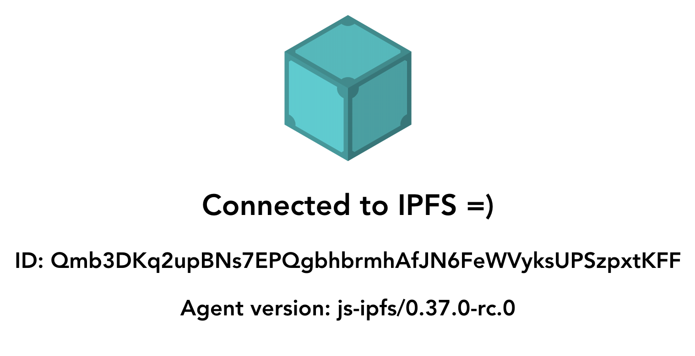

# IPFS Vue Example

A BASIC demonstration of how to use `js-ipfs` with `Vue`.

```...
const IPFS = require('ipfs-core')
const ipfs = await IPFS.create()
const { cid } = await ipfs.add('Hello world')
console.info(cid)
// QmXXY5ZxbtuYj6DnfApLiGstzPN7fvSyigrRee3hDWPCaf
```



This project was bootstrapped with [Vue CLI](https://cli.vuejs.org/).

## Before you start

First clone this repo, install dependencies in the project root and build the project.

```console
$ git clone ...
$ cd browser-vue
$ npm install
$ npm run serve
```
